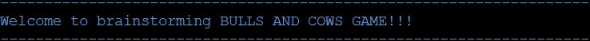
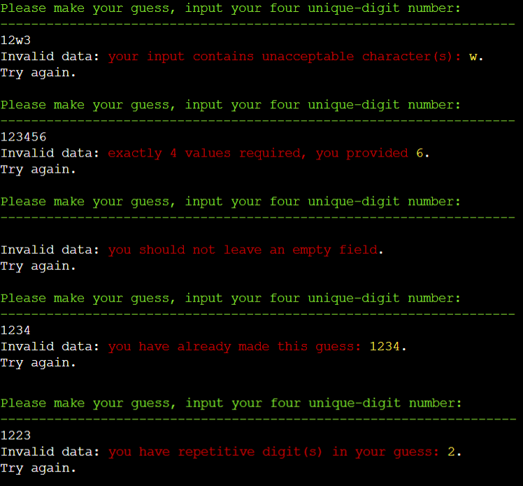

# BULLS AND COWS

Bulls and Cows is a Python terminal game, which runs in the Code Institute mock terminal on Heroku.

[BULLS AND COWS game](https://en.wikipedia.org/wiki/Bulls_and_Cows) is a popular guessing game that can be played by two or more people. The object of the game is to guess a secret code consisting of a sequence of digits. Each guess is compared to the secret code, and the number of "bulls" and "cows" is counted and revealed to the guesser. In this version of the game, the computer generates a secret number which the user must guess.

## How to play
1. The game is played with a four unique-digit number.
2. The computer generates a random number for the player to guess.
3. The player makes a guess by entering a 4-digit number.
4. If the player guesses a digit that is in the correct position in
the chosen number, it is called a "bull".
5. If the player guesses a digit that is in the chosen number, but
in a different position, it is called a "cow".
6. The computer responds to each guess with the number of bulls
and cows. For example, if the chosen number is 4827 and the player
guesses 1234, the computer would respond with "0 bulls, 2 cow" because
the player guessed the digit 2, which is in the chosen number, but
in a different position.
7. The player continues to guess until they correctly guess the entire
number (i.e., four bulls).

[Here is the live version of my project](https://project-3-gennadiy-gaysha.herokuapp.com/)

## Table of Contents

1. [User Experience (UX)](#user-experience-ux)
    1. [Project Goals](#project-goals)
    2. [User Stories](#user-stories)
    3. [Color Scheme](#color-scheme)
    4. [Data Model](#data-model)
    5. [Flowchart](#flowchart)
2. [Features](#features)
    1. [Secret number generation](#secret-number-generation)
    2. [Input validation](#input-validation)
    3. [Guess and score output](#guess-and-score-output)
    4. [Win game message](#win-game-message)
    5. [Restart or End Game](#restart-or-end-game)
3. [Technologies Used](#technologies-used)
    1. [Languages Used](#languages-used)
    2. [Frameworks, Libraries and Programs Used](#frameworks-libraries-and-programs-used)
4. [Testing](#testing)
    1. [Testing User Stories](#testing-user-stories)
    2. [Code Validation](#code-validation)
    3. [Accessibility](#accessibility)
    4. [Tools Testing](#tools-testing)
    5. [Manual Testing](#manual-testing)
5. [Finished Product](#finished-product)
6. [Deployment](#deployment)
7. [Cloning and Forking Repository](#cloning-and-forking-repository)
    1. [Cloning the Repository](#cloning-the-repository)
    2. [Forking the Repository](#forking-the-repository)
8. [Credits](#credits)
    1. [Content](#content)
    2. [Media](#media)
    3. [Code](#code)

***

## User Experience (UX)

### Project Goals

- Game rules should be displayed first in the terminal so that the user has a clear understanding of how to play.

- Validation methods should cover all possible values the user can input.

- Since it is a terminal application with limited possibilities in terms of design, it is important to have a font color scheme that is pleasant to the eye.

- Each step of the game should be accompanied by a hint so that the user always understands what they should do.

- After each guess, the user should see not only the current score but also all previous results.

- After guessing the secret number, the user is offered the option to start a new game or end the game.

### User Stories

- As a player, I would like to get acquainted with the game rules first so that I can have a clear understanding of how to play and what is expected of me.

- As a player, I would like to receive short and clear hints on what to do at each step of the game so that I can progress through the game without confusion and frustration.

- As a player, I would like the color scheme to be pleasing to the eye and not irritating so that I can play the game comfortably without experiencing eye strain or discomfort.

- As a player, I would like the game to not end if I enter incorrect data and give me a clear understanding of what I did wrong so that I can learn from my mistakes and continue playing the game.

- As a player, I would like to see all the current results of the game so that it's easier for me to make further decisions.

- As a player, I would like to have the ability to continue or end the game according to my own wishes so that I can play the game at my own pace and decide when to stop or continue playing.

### Color Scheme

[Colorama](https://pypi.org/project/colorama/) has been used to apply color to the terminal text for improved intuition and readability. 

Here are the colors being used:

#### Infoline color:

#### Game Rules color:

#### Error colors:

#### Guess colors:

#### Win game colors:

#### Restart Game color:

#### End game colors:

### Data Model

I decided to use Guess class as a template. This class takes two lists as instance parameters during initialization. The first parameter is passed as an argument when creating an instance of the class, which is based on user input. The second parameter contains a list of digits for the secret number, generated by number_generator function. Guess class also contains class attribute called guess_list, which adds to the list instance attributes after each initialization.

Guess class has methods for counting the number of digits that are in the correct position (BULLS) and counting the number of digits that are in the chosen number (COWS).

Guess class has also show_all_scores method that generates a dictionary of guess/score pairs as key|value pairs and prints all scores in the terminal in user-friendly format

### Flowchart

[app.diagrams.net](https://app.diagrams.net/) program was utilized to create a flowchart which outlines the logical sequence to be incorporated into the program.

## Features

### Existing features

#### Secret number generation
- Upon starting or restarting the game, the program generates a list of four unique digits at random that the player must guess. Currently, and for testing purposes, this list is visible (indicated by the red arrow), but it will be hidden before project submission: <#print(secret_number)>.

#### Input validation
- Five types of exceptions were used to handle specific errors or unexpected situations that may arise from user input.

#### Guess and score output
- show_all_scores method from Guess class prints all the guesses and scores in a user-friendly format on the terminal.

#### Win game message
- Each time the Player wins, a bright victory message appears and the Player is presented with two options: either to continue playing or to exit the game. 

#### Restart or End Game
- Restarting the game (by pressing 'Y') generates a new secret number, resets all class and class instance data, and begins a new cycle of the game.

#### Exiting the Game
- If the player exits the game (by pressing 'N'), the following message appears:  

#### Invalid input
- If the player mistakenly presses a key other than 'Y' or 'N', an error message appears prompting them to correct their selection.

### Future features

- Allow the player to choose a number with a different number of digits than 4 (e.g., a 5-digit number) for them to guess.

## Technologies Used
### Language Used

* [Python3](https://en.wikipedia.org/wiki/Python_(programming_language))

### Frameworks, Libraries and Programs Used

- [GitPod](https://gitpod.io/) was used for writing code, committing, and then pushing to GitHub.

- [GitHub](https://github.com/) was used to store the project after pushing.

- [Heroku](https://id.heroku.com/) was used to deploy the application.

- [PEP8 online check](http://pep8online.com/) was used to validate the Python code.

- [Colorama](https://pypi.org/project/colorama/) library was used to apply color to the terminal text. 

- [Diagrams.net](https://app.diagrams.net/) was used to create the program flowchart.

[Back To The Table of Contents ⇧](#table-of-contents)

## Testing

### Testing User Stories

 - As a player, I would like to get acquainted with the game rules first so that I can have a clear understanding of how to play and what is expected of me.
    - Before starting the game, the [rules](#how-to-play) are displayed in the terminal to provide the user with a complete understanding of how to play. This ensures that every time the game is launched, the user is informed of the rules.

- As a player, I would like to receive short and clear hints on what to do at each step of the game so that I can progress through the game without confusion and frustration.
    - Throughout the game, prompts are provided to guide the user through each step and ensure their understanding.

- As a player, I would like the color scheme to be pleasing to the eye and not irritating so that I can play the game comfortably without experiencing eye strain or discomfort.
    - Given the limited design options in a terminal application, a [font color scheme](#color-scheme) that is easy on the eyes was employed.

- As a player, I would like the game to not end if I enter incorrect data and give me a clear understanding of what I did wrong so that I can learn from my mistakes and continue playing the game.
    - The use of [five types of exceptions](#input-validation) enables the handling of all specific errors or unexpected scenarios that may result from user input.

- As a player, I would like to see all the current results of the game so that it's easier for me to make further decisions.
    - Along with the current score, the user can view their [previous guesses and scores](#guess-and-score-output) after each attempt.
- As a player, I would like to have the ability to continue or end the game according to my own wishes so that I can play the game at my own pace and decide when to stop or continue playing.
    - Once the user has guessed the secret number, they can select [either to start a new game or end the current game](#restart-or-end-game).

    ### Code Validation

- HTML 
    - Main page - no errors were returned when passing through the official [W3C validator - index.html](https://validator.w3.org/nu/?doc=https%3A%2F%2Fgennadiy-gaysha.github.io%2Fportfolio_project_2%2Findex.html)
    - Error 404 page - no errors were returned when passing through the official [W3C validator - rent.html](https://validator.w3.org/nu/?doc=https%3A%2F%2Fgennadiy-gaysha.github.io%2Fportfolio_project_2%2F404.html)
- CSS 
    - style.css - no errors were found when passing through the official [(Jigsaw) validator](https://jigsaw.w3.org/css-validator/validator?uri=https%3A%2F%2Fgennadiy-gaysha.github.io%2Fportfolio_project_2%2Findex.html&profile=css3svg&usermedium=all&warning=1&vextwarning=&lang=en)
- JS 
    - script.js - no errors were found when passing through the official [JSHints JavaScript Code Quality Tool](https://jshint.com/)
    - common.js - no errors were found when passing through the official [JSHints JavaScript Code Quality Tool](https://jshint.com/)

### Accessibility

- I confirmed that the colors and fonts chosen are easy to read and accessible by running it through Lighthouse in Devtools
    - **index.html**

    

    - **404.html**

    

### Tools Testing

* [Chrome DevTools](https://developer.chrome.com/docs/devtools/)

    - Chrome DevTools was used during the development process to test, explore and modify HTML elements and CSS styles and lookin for errors in JS code.

### Manual Testing

* Browser Compatibility 

    - All site functions work correctly and the same in browsers that have different engines, i.e. Chrome, Firefox and Safari:

Browser | Outcome | Pass/Fail  
--- | --- | ---
Google Chrome | No problems related to the appearance, responsiveness or functionality of the website | Pass
Safari | No problems related to the appearance, responsiveness or functionality of the website | Pass
Mozilla Firefox | No problems related to the appearance, responsiveness or functionality of the website | Pass
Microsoft Edge | No problems related to the appearance, responsiveness or functionality of the website | Pass
 

* Testing Style And Functionality

| Feature | Element | Test | Outcome  | Pass/Fail |
|---|---|---|---|---|
| Start panel | "Start game" button | Style | Hovering over the button sets the cursor property to "pointer" | Pass |
|  | "Start game" button | Style | Clicking on the button mimics the effect of physically clicking the   button | Pass |
|  | "Start game" button | Functionality | Clicking the button redirects to Play Panel | Pass |
| Play panel - Playing area | An interactive information line | Functionality | An interactive infoline shows the actual number of throws left | Pass |
|  | "Roll dice" & "Hold dice" buttons | Style | Hovering over the button sets the cursor property to "pointer" | Pass |
|  | "Roll dice" & "Hold dice" buttons | Style | Clicking on the button mimics the effect of physically clicking the   button | Pass |
|  | "Roll dice" | Functionality | Clicking the button rolls the dice (generating five random numbers on   them) | Pass |
|  | "Roll dice" | Functionality | Three dice rolls are possible in one turn | Pass |
|  | "Roll dice" | Functionality | After   the third roll, an interactive information line prompts the user to write   down their current score | Pass |
|  | "Roll dice" | Functionality | After   attempting to click the button four times in a row, an alert message appears | Pass |
|  | "Roll dice" & "Hold dice" buttons | Functionality | Clicking   the 'Roll Dice' button does not roll the dice that are being held | Pass |
|  | "Hold dice" buttons (row of five dice) | Functionality | After   clicking on a dice, it becomes held and its color changes to yellow | Pass |
|  | "Hold dice" buttons (row of five dice) | Functionality | After   unclicking a dice, it becomes unheld and its color changes to white | Pass |
|  | "Roll dice" & "Hold dice" buttons | Functionality | After   the third roll, it is not possible to hold the dice, and they remain white   even after clicking on them | Pass |
| Play Panel - Score area | Score table values of current score | Style | Hovering over the values sets the cursor property to "pointer" | Pass |
|  | Score table values of current score | Style | Hovering over the values changes their background and font colors | Pass |
|  | Score table values of current score | Functionality | Before the "Roll dice" button is clicked for the   first time, they become inactive | Pass |
|  | Score table values of current score | Functionality | When   the 'Roll dice' button is clicked, the correct score values are displayed   based on the score rules | Pass |
|  | Score table values of current score | Functionality | When the "Roll dice" button is clicked, they become   active and it is possible to write down the current score | Pass |
|  | Score table current score lines | Functionality | After writing down the current score the line changes its   color to red | Pass |
|  | Score table current score lines | Functionality | After writing down the current score all the score lines become inactive | Pass |
|  | Score table current score lines | Functionality | After writing down the current score all the buttons in Playing area and   interactive infoline reset to start position | Pass |
| Play Panel | 3 pink auxiliary buttons | Style | Hovering over the button sets the cursor property to "pointer" | Pass |
|  | 3 pink auxiliary buttons | Style | Clicking on the button mimics the effect of physically clicking the   button | Pass |
|  | "Game rules" auxiliary button | Functionality | Clicking on the button redirects the User to appropriate panel hiding the   Play panel | Pass |
|  | "Restart game" auxiliary button | Functionality | Clicking   on the button, after the current score is written down, all the buttons in   the playing area and the interactive infoline reset to their starting   positions | Pass |
|  | "Max score" auxiliary button | Functionality | Clicking on the button redirects the User to appropriate panel hiding the   Play panel | Pass |
| Game Rules panel | "Back to play" button | Style | Hovering over the button sets the cursor property to "pointer" | Pass |
|  | "Back to play" button | Style | Clicking on the button mimics the effect of physically clicking the   button | Pass |
|  | "Back to play" button | Functionality | Clicking the button redirects the User to Play panel hiding the Game   Rules panel | Pass |
| Max Score panel | "Back to play" button | Style | Hovering over the button sets the cursor property to "pointer" | Pass |
|  | "Back to play" button | Style | Clicking on the button mimics the effect of physically clicking the   button | Pass |
|  | "Back to play" button | Functionality | Clicking the button redirects the User to Play panel hiding the Max Score   panel | Pass |
|  | Max Score table | Functionality | In   the table, the numbered historical scores with the date and time is   automatically recorded in descending order | Pass |
|  | Max Score table | Functionality | The   table contains 15 rows of data | Pass |
|  | Max Score table | Functionality | All the table data are saved on User computer (Local Storage   API) | Pass |
|  | Max Score table | Functionality | Table   data are stored on the user's computer in the browser's Local Storage. | Pass |
|  | Max Score table | Functionality | The table data will be available to the user even after they close the   browser or shut down their computer | Pass |
| End of the Game panel | Interactive infoline | Functionality | The   score that the player has earned is shown on the infoline | Pass |
|  | "Play again" button | Style | Hovering over the button sets the cursor property to "pointer" | Pass |
|  | "Play again" button | Style | Clicking on the button mimics the effect of physically clicking the   button | Pass |
|  | "Play again" button | Functionality | Clicking the button redirects the User to Play panel hiding the End of   the Game Panel panel | Pass |
| Site   responsiveness | All panels | > 1500 | Look   good and function on the chosen screen size using the Chrome devtools toolbar | Pass |
|  |  | <= 1500 | Look good and function on the chosen screen size using the   Chrome devtools toolbar | Pass |
|  |  | <= 1350 | Look good and function on the chosen screen size using the   Chrome devtools toolbar | Pass |
|  |  | <= 1200 | Look good and function on the chosen screen size using the   Chrome devtools toolbar | Pass |
|  |  | <= 1100 | Look good and function on the chosen screen size using the   Chrome devtools toolbar | Pass |
|  |  | <= 920 | Look good and function on the chosen screen size using the   Chrome devtools toolbar | Pass |
|  |  | <= 850 | Look good and function on the chosen screen size using the   Chrome devtools toolbar | Pass |
|  |  | <= 768 | Look good and function on the chosen screen size using the   Chrome devtools toolbar | Pass |
|  |  | <= 567 | A   panel with an informational message appears, suggesting that the user rotate   their mobile device to landscape mode | Pass |
| 404 Error page | Page itself | Functionality | Appears when a user attempts to access a page that does not exist on the website | Pass |
|  | "Back to play" button | Style | Hovering over the button sets the cursor property to "pointer" | Pass |
|  | "Back to play" button | Style | Clicking on the button mimics the effect of physically clicking the   button | Pass |
|  | "Back to play" button | Functionality | Clicking the button redirects the User to Play panel hiding the 404 Error   page | Pass |
| Sound effects | Roll-dice sound  | Functionality | Occurs when the User clicks on "Roll dice" button | Pass |
|  | Entered current score sound | Functionality | Occurs when the User enters their current score | Pass |
|  | Yahtzee won sound | Functionality | Occurs when Yahtzee is rolled | Pass |
|  | Bonus won sound | Functionality |Occurs when User earns a bonus | Pass |
|  | End of the game sound | Functionality |Occurs when the round ends | Pass |

[Back To The Table of Contents ⇧](#table-of-contents)

## Finished Product

Page / Section | Image
--- | ---
Desktop Version | 
Mobile version (for screen whidth <= 768px)| 
Start panel | 
Game rules panel | 
Max score panel | 
End game panel | 
Lock of portrait mode | 
404 Error Page | 

 

[Back To The Table of Contents ⇧](#table-of-contents)

## Deployment

- This website was developed using [GitPod](https://www.gitpod.io/), which was then committed and pushed to GitHub using the GitPod terminal.

- The site was deployed to GitHub pages. The steps to deploy are as follows: 
    1. Log in to GitHub and locate the [GitHub Repository](https://github.com/).
    2. At the top of the Repository, locate the Settings button on the menu.
    3. On the left of the Settings page choose the Pages section.
    4. Under Source, click the dropdown called None and select Main Branch.
    5. The page will refresh automatically and generate a link to your website.

You can visit the deployed website  [here](https://gennadiy-gaysha.github.io/portfolio_project_2/index.html)

## Cloning and Forking Repository
To make changes to the code without affecting the original version stored in the repository you may create a local copy of the repository, through cloning and forking methods.

### Cloning the Repository

- Install Git on your local machine, if it is not already installed.
- Navigate to the repository you want to clone in a web browser.
- Click the "Clone or download" button and copy the repository's URL (`https://github.com/gennadiy-gaysha/portfolio_project_2.git`)to your clipboard.
- Open a terminal or command prompt on your local machine.
- Change to the directory where you want to clone the repository.
- Type the command `git clone https://github.com/gennadiy-gaysha/portfolio_project_2.git` and press enter.
- Wait for the repository to download to your local machine.
- Once the repository is downloaded, you can make changes to the code and use Git to manage and sync those changes with the original repository.

### Forking the Repository

- Navigate to the repository you want to fork in a web browser.
- Click the "Fork" button in the top right corner of the page.
- Select your account as the destination for the forked repository.
- Wait for the repository to be forked to your account.
- Once the repository is forked, you can clone it to your local machine using the steps above for cloning a repository.
- You can make changes to the code and commit those changes to your forked repository. If you want to contribute those changes back to the original repository, you can create a pull request from your forked repository to the original repository.

These instructions should help you create a local copy of a code repository using both cloning and forking methods, allowing you to make changes to the code and collaborate with other developers on the project.

## Credits

- I'm acknowleged to my student friends who introduced me to the computer game Yahtzee back in the 80s. I tried to reproduce the design of that exact game as accurately as possible on my website.
- Since the JS code for creating an [interactive table](#max-score-panel) with historical results (Max score panel) was written with the help of prompts from the [GPT Chat](https://chat.openai.com/chat), it cannot be considered written by me personally.

### Content

- Markdown for the testing table in readme.md file was created using [Tables Generator](https://www.tablesgenerator.com/markdown_tables) 
- Grammar and spelling were checked using the power of [GPT Chat](https://chat.openai.com/chat) and [Grammarly](https://www.grammarly.com/) web app. 

### Media

- All sound effects were taken from open source site [https://pixabay.com/](https://pixabay.com/sound-effects/search/dice/).
- The images used as [Mockups](#mockup) were taken from open source sites.

### Code

- I've been constantly using [Stack Overflow](https://stackoverflow.com/), 
[W3Schools](https://www.w3schools.com/) and Chrome Dev tools for inspiration 
and better understanding the code being implemented.

[Back To The Table of Contents ⇧](#table-of-contents)