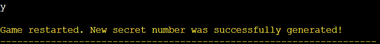
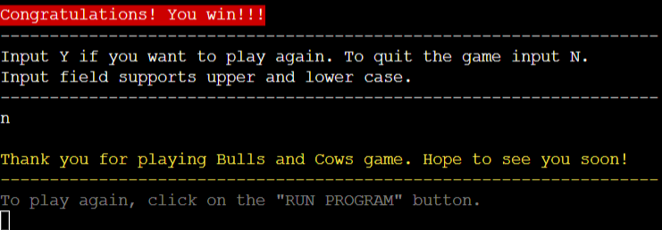
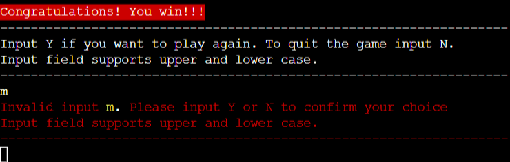

# BULLS AND COWS

Bulls and Cows is a Python terminal game, which runs in the Code Institute mock terminal on Heroku.

[BULLS AND COWS game](https://en.wikipedia.org/wiki/Bulls_and_Cows) is a popular guessing game that can be played by two or more people. The object of the game is to guess a secret code consisting of a sequence of digits. Each guess is compared to the secret code, and the number of "bulls" and "cows" is counted and revealed to the guesser. 

`In this version of the game, the computer generates a secret number which the User must guess.`

## How to play
1. The game is played with a four unique-digit number.
2. The computer generates a random number for the User to guess.
3. The User makes a guess by entering a 4-digit number.
4. If the User guesses a digit that is in the correct position in
the chosen number, it is called a "bull".
5. If the User guesses a digit that is in the chosen number, but
in a different position, it is called a "cow".
6. The computer responds to each guess with the number of bulls
and cows. For example, if the chosen number is 4827 and the User
guesses 1234, the computer would respond with "0 bulls, 2 cow" because
the User guessed the digit 2, which is in the chosen number, but
in a different position.
7. The User continues to guess until they correctly guess the entire
number (i.e., four bulls).

[Here is the live version of my project](https://project-3-gennadiy-gaysha.herokuapp.com/)

## Table of Contents

1. [User Experience (UX)](#user-experience-ux)
    1. [Project Goals](#project-goals)
    2. [User Stories](#user-stories)
    3. [Color Scheme](#color-scheme)
    4. [Data Model](#data-model)
    5. [Flowchart](#flowchart)
2. [Features](#features)
    1. [Secret number generation](#secret-number-generation)
    2. [Input validation](#input-validation)
    3. [Guess and score output](#guess-and-score-output)
    4. [Win game message](#win-game-message)
    5. [Restart or End Game](#restart-or-end-game)
3. [Technologies Used](#technologies-used)
    1. [Language Used](#language-used)
    2. [Frameworks, Libraries and Programs Used](#frameworks-libraries-and-programs-used)
4. [Testing](#testing)
    1. [Testing User Stories](#testing-user-stories)
    2. [Code Validation](#code-validation)
    3. [Manual Testing](#manual-testing)
5. [Deployment](#deployment)
6. [Cloning and Forking Repository](#cloning-and-forking-repository)
    1. [Cloning the Repository](#cloning-the-repository)
    2. [Forking the Repository](#forking-the-repository)
7. [Credits](#credits)
    1. [Content](#content)
    2. [Media](#media)
    3. [Code](#code)
8. [Acknowledgements](#acknowledgements)

## User Experience (UX)

### Project Goals

- Game rules should be displayed first in the terminal so that the User has a clear understanding of how to play.

- Validation methods should cover all possible values the User can input.

- Since it is a terminal application with limited possibilities in terms of design, it is important to have a font color scheme that is pleasant to the eye.

- Each step of the game should be accompanied by a hint so that the User always understands what they should do.

- After each guess, the User should see not only the current score but also all previous results.

- After guessing the secret number, the User is offered the option to start a new game or end the game.

### User Stories

- As a User, I would like to get acquainted with the game rules first so that I can have a clear understanding of how to play and what is expected of me.

- As a User, I would like to receive short and clear hints on what to do at each step of the game so that I can progress through the game without confusion and frustration.

- As a User, I would like the color scheme to be pleasing to the eye and not irritating so that I can play the game comfortably without experiencing eye strain or discomfort.

- As a User, I would like the game to not end if I enter incorrect data and give me a clear understanding of what I did wrong so that I can learn from my mistakes and continue playing the game.

- As a User, I would like to see all the current results of the game so that it's easier for me to make further decisions.

- As a User, I would like to have the ability to continue or end the game according to my own wishes so that I can play the game at my own pace and decide when to stop or continue playing.

### Color Scheme

[Colorama](https://pypi.org/project/colorama/) has been used to apply color to the terminal text for improved intuition and readability. 

Here are the colors being used:

#### Infoline color:

#### Game Rules color:

#### Error colors:

#### Guess colors:

#### Win game colors:

#### Restart Game color:

#### End game colors:

### Data Model

I decided to use Guess class as a template. This class takes two lists as instance parameters during initialization. The first parameter is passed as an argument when creating an instance of the class, which is based on User input. The second parameter contains a list of digits for the secret number, generated by number_generator function. Guess class also contains class attribute called guess_list, which adds to the list instance attributes after each initialization.

Guess class has methods for counting the number of digits that are in the correct position (BULLS) and counting the number of digits that are in the chosen number (COWS).

Guess class has also show_all_scores method that generates a dictionary of guess/score pairs as key|value pairs and prints all scores in the terminal in user-friendly format

### Flowchart

[app.diagrams.net](https://app.diagrams.net/) program was utilized to create a flowchart which outlines the logical sequence to be incorporated into the program.

[Back To The Table of Contents ⇧](#table-of-contents)

## Features

### Existing features

#### Secret number generation
- Upon starting or restarting the game, the program generates a list of four unique digits at random that the User must guess. Currently, and for testing purposes, this list is visible (indicated by the red arrow), but it will be hidden before project submission: <#print(secret_number)>.

#### Input validation
- Five types of exceptions were used to handle specific errors or unexpected situations that may arise from User input.

#### Guess and score output
- show_all_scores method from Guess class prints all the guesses and scores in a user-friendly format on the terminal.

#### Win game message
- Each time the User wins, a bright victory message appears and the User is presented with two options: either to continue playing or to exit the game. 

#### Restart or End Game
- Restarting the game (by pressing 'Y') generates a new secret number, resets all class and class instance data, and begins a new cycle of the game.

#### Exiting the Game
- If the User exits the game (by pressing 'N'), the following message appears:  

#### Invalid input
- If the User mistakenly presses a key other than 'Y' or 'N', an error message appears prompting them to correct their selection.

### Future features

- Allow the User to choose a number with a different number of digits than 4 (e.g., a 5-digit number) for them to guess.

[Back To The Table of Contents ⇧](#table-of-contents)

## Technologies Used

### Language Used

- [Python3](https://en.wikipedia.org/wiki/Python_(programming_language))

### Frameworks, Libraries and Programs Used

- [GitPod](https://gitpod.io/) was used for writing code, committing, and then pushing to GitHub.

- [GitHub](https://github.com/) was used to store the project after pushing.

- [Heroku](https://id.heroku.com/) was used to deploy the application.

- [PEP8 online check](https://pep8ci.herokuapp.com/) was used to validate the Python code.

- [Colorama](https://pypi.org/project/colorama/) library was used to apply color to the terminal text.

- [Diagrams.net](https://app.diagrams.net/) was used to create the program flowchart.

[Back To The Table of Contents ⇧](#table-of-contents)

## Testing

### Testing User Stories

 - As a User, I would like to get acquainted with the game rules first so that I can have a clear understanding of how to play and what is expected of me.
    - Before starting the game, the [rules](#how-to-play) are displayed in the terminal to provide the User with a complete understanding of how to play. This ensures that every time the game is launched, the User is informed of the rules.

- As a User, I would like to receive short and clear hints on what to do at each step of the game so that I can progress through the game without confusion and frustration.
    - Throughout the game, prompts are provided to guide the User through each step and ensure their understanding.

- As a User, I would like the color scheme to be pleasing to the eye and not irritating so that I can play the game comfortably without experiencing eye strain or discomfort.
    - Given the limited design options in a terminal application, a [font color scheme](#color-scheme) that is easy on the eyes was employed.

- As a User, I would like the game to not end if I enter incorrect data and give me a clear understanding of what I did wrong so that I can learn from my mistakes and continue playing the game.
    - The use of [five types of exceptions](#input-validation) enables the handling of all specific errors or unexpected scenarios that may result from User input.

- As a User, I would like to see all the current results of the game so that it's easier for me to make further decisions.
    - Along with the current score, the User can view their [previous guesses and scores](#guess-and-score-output) after each attempt.
- As a User, I would like to have the ability to continue or end the game according to my own wishes so that I can play the game at my own pace and decide when to stop or continue playing.
    - Once the User has guessed the secret number, they can select [either to start a new game or end the current game](#restart-or-end-game).

### Code Validation

Throughout the development process, the [PEP8 Python Validator](https://pep8ci.herokuapp.com/) was consistently utilized to ensure that the Python code adhered to PEP8 requirements. This led to the identification and successful resolution of all errors.

### Manual Testing
- All tests were performed in my local terminal and the Code Institute Heroku terminal.

| Feature | Outcome | Pass/Fail |
|---|---|---|
| Guess input | Check if any of the values is not an integer. | Pass |
|  |  |  |
|  | Check if exactly four digits were not provided. | Pass |
|  |  |  |
|  | Check if the value is an empty   string. | Pass |
|  |  |  |
|  | Check if the same value has been entered again. | Pass |
|  |  |  |
|  | Check if there are any repeating digits in the number. | Pass |
|  |  |  |
| Bull_counter | Check the count of digits that are in their correct position. | Pass |
|  |  |  |
| Cow_counter | Check the count of digits in the chosen number. | Pass |
|  |  |  |
| All zeros score | Check the count when the entered digits are not present in the   hidden number. | Pass |
|  |  |  |
| Win game message | Check the message when the Player wins the game. | Pass |
|  |  |  |
| Restart the game | Check the message when the Player decides to continue playing. | Pass |
|  |  |  |
| Exit the game | Check the message when the Player decides to exit the game. | Pass |
|  |  |  |
| Y/N input failure | Check the message if the Player mistakenly presses a key other   than 'Y' or 'N'. | Pass |
|  |  |  |

[Back To The Table of Contents ⇧](#table-of-contents)

## Deployment

The application has been deployed using [Heroku](https://id.heroku.com/) by following these steps:

[Heroku](https://id.heroku.com/) was used to deploy the application.

1. Create the requirements.txt file and run: `pip3 freeze > requirements.txt` in the console.
2. Commit changes and push them to GitHub.
3. Go to the Heroku's website.
4. From the Heroku dashboard, click on "Create new app".
5. Enter the "App name" and "Choose a region" before clicking on "Create app".
6. Go to "Config Vars" under the "Settings" tab.
7. Add the Config Var, KEY: PORT and VALUE: 8000.
8. Go to "Buildpacks" section and click "Add buildpack".
9. Select "python" and click "Save changes"
10. Add "nodejs" buildpack as well using the same process.
11. Go to "Deployment method", under the "Deploy" tab select "GitHub" and click on "Connect to GitHub".
12. Go to "Connect to GitHub" section and "Search" the repository to be deployed.
13. Click "Connect" next the repository name.
14. Choose "Automatic deploys" or "Manual deploys" to deploy your application.

You can visit the deployed website [here](https://project-3-gennadiy-gaysha.herokuapp.com/)

[Back To The Table of Contents ⇧](#table-of-contents)

## Cloning and Forking Repository
To make changes to the code without affecting the original version stored in the repository you may create a local copy of the repository, through cloning and forking methods.

### Cloning the Repository

- Install Git on your local machine, if it is not already installed.
- Navigate to the repository you want to clone in a web browser.
- Click the "Clone or download" button and copy the repository's URL (`https://github.com/gennadiy-gaysha/portfolio_project_3`) to your clipboard.
- Open a terminal or command prompt on your local machine.
- Change to the directory where you want to clone the repository.
- Type the command `git clone https://github.com/gennadiy-gaysha/portfolio_project_3.git` and press enter.
- Wait for the repository to download to your local machine.
- Once the repository is downloaded, you can make changes to the code and use Git to manage and sync those changes with the original repository.

### Forking the Repository

- Navigate to the repository you want to fork in a web browser.
- Click the "Fork" button in the top right corner of the page.
- Select your account as the destination for the forked repository.
- Wait for the repository to be forked to your account.
- Once the repository is forked, you can clone it to your local machine using the steps above for cloning a repository.
- You can make changes to the code and commit those changes to your forked repository. If you want to contribute those changes back to the original repository, you can create a pull request from your forked repository to the original repository.

These instructions should help you create a local copy of a code repository using both cloning and forking methods, allowing you to make changes to the code and collaborate with other developers on the project.

## Credits

### Content

- I appreciate my school friend for introducing me to this game and playing it with me frequently, which helped us enhance our analytical thinking skills.

- The rules for the Bulls and Cows game were derived from various open-source internet sites, including [Wikipedia](https://en.wikipedia.org/wiki/Bulls_and_Cows).

### Media

- ASCII Art of name of the game was generated by [ASCII Generator](https://ascii-generator.site/)

### Code

- Hints from [ChatGPT](https://chat.openai.com/) helped me fix minor errors (E501: line too long, and E128: continuation line under-indented for visual indent) in my code.

## Acknowledgements

- My partner for her unwavering love, support, and encouragement throughout this project. Her belief in me has been a driving force, and I could not have done it without her.

- My tutor, Marcel, for his priceless feedback and guidance.

- Code Institute and their fantastic Slack community for their constant support and providing me with the essential knowledge and resources that I needed to successfully finish this project.

[Back To The Table of Contents ⇧](#table-of-contents)